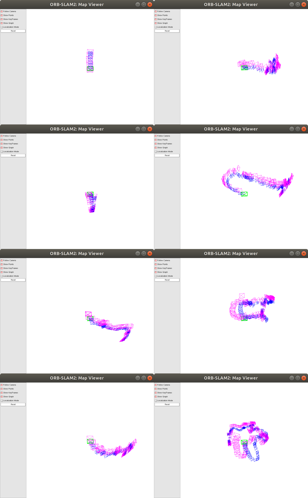

# Direct VO
This is a lib compare the direct visual odomtry with ORBSLAM2. It is not a fair comparison because we didn't develop direct method with Bundle Adjustment but just frame to frame tracking.
# Install
Please refer the original ORB_SLAM2 for the dependencies.
We use GPU to extract the high gradient pixels of the image so you also need the nividia sdk
```
git clone https://github.com/zhaozhongch/direct_vs_feature_vo.git
cd direct_vs_feature_vo
./build.sh
```
# Run
```
./run_tum_rgbd.sh
```
Modify the associations and dataset address in the script.    
You should be able to see the output like the following  

The blue frames are estimated from the ORBSLAM2 and the pink frames are from the direct odometry.

# Others
Please cite the reference thesis if you consider this lib in any of your work
```
TO ADD
```
The detail implementation description is in the thesis SLAM chapter.
